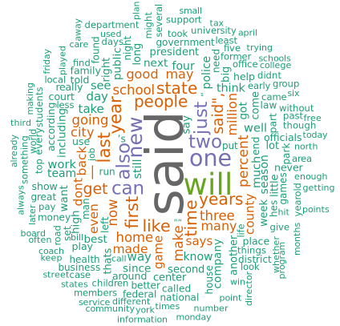

Predict Next Word App
========================================================
author: Sara Regina Ferreira de Faria
date: 2019, February 16th
autosize: true
transition: fade

The situation
========================================================
transition: fade

Around the world, people are spending an increasing amount of time on their mobile devices for email, social networking, banking and a whole range of other activities. 

But typing on mobile devices can take several minutes and be a serious pain. 

So our solution is to build a system that makes it easier for people to type on their mobile devices. 

***

We will use the computer processing capabilitty to build a smart solution that help you to predict the next word you want to type!

***

 </img> 

Studying the data
========================================================
transition: fade

We've got 556MB of data from blogs, twitter and news written in English. 

After cleaning the data (removing the stop words, the ponctuations, the number, the profane words, etc.), we made several studies to understand the data we were dealing with.

 </img> 

***

The common steps in natural language processing are:

- **Lexical Analysis**: identifying and analyzing the structure of words. The goal is to divide the chunk of txt into paragraphs, sentences, and words.

- **Syntactic Analysis**: to arrange the words in a manner that shows the relationship among them.

- **Semantic Analysis**: in this phase, the meaning of the single phrase is analysed.

- **Discourse Integration**: now the meaning of the hole text is analysed. The current phrase cepends on the meaning of the previous one and will imply in the meaning of the next one.

The Algorithm
========================================================
transition: fade

First of all, the data was prepared to be used by the prediction model. All the texts were splitted in 2-grams, 3-grams and 4-grams.

The algorithm to predict the next word the user wants to type follow this steps:

- The input prhase is treated the same way the whole dataset was (removing the stop words, the ponctuations, the number, the profane words, etc.)

- It takes the last three words and search for it the 4-grams. If it is found, the three most common next words are displayed to the user as the predicted words;

- If the combination of three words was not found in the 4-grams, it looks for the last two words in the 3-grams. If it is found, the three most common next words are displayed to the user as the predicted words;

***

- If the combination of two words was not found in the 3-grams, it looks for the last word in the 2-grams. If it is found, the three most common next words are displayed to the user as the predicted words;

- If teven thought any next word is found, the alogirthms suggest the top three most common words as the predicted words;

 </img> 

How can you test it?
========================================================
transition: fade

The simplest way to test this algorithm is using a Shiny App. 

You can access it in this link:

To use it you have to type the wanted phrase and press 'OK'. After that, the app will display three suggested words to be the next one in the phrase.

Enjoy it!

